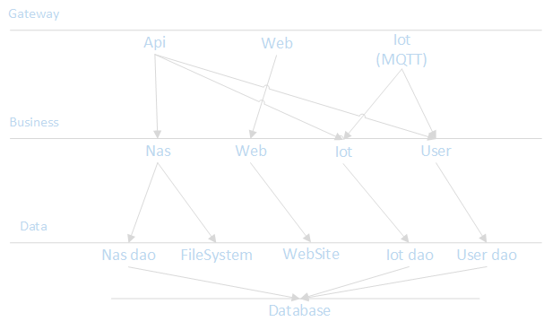
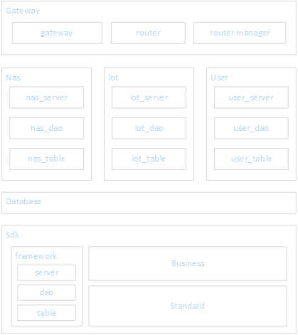

# 工程结构

 module   | component                                     | class
 ---------|-----------------------------------------------|-------
 gateway  | gateway, router, router_mgr                   |
 nas      | nas_server(sub_router), nas_dao, nas_table    |
 iot      | iot_server(sub_router), iot_dao, iot_table    |
 user     | user_server(sub_router), user_dao, user_table |
 database |                                               |
 sdk      | framework                                     | VultureServer, VultureDao, VultureTable
 sdk      | business, standard                            |

# 架构层级

# 模块结构

# TODO List
 - 移植天气节点到api.vulture.com
 - Log输入到文件，以便作为服务启动时没有log输出
